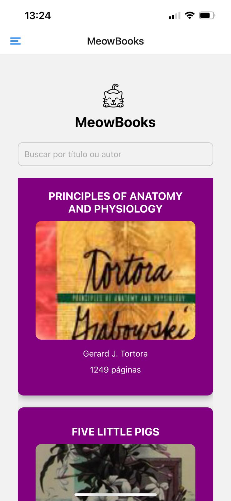

# Meow Cafe

Bem-vindo ao projeto **Meow Cafe**! MeowBooks é um aplicativo para busca de livros desenvolvido para a disciplina de mobile. Ele faz uso de uma API gratuita com livros cujo domínio é livre.




## Informações do Projeto

**Nome:** meowBook  
**Versão:** 1.0.0  
**Entrada principal:** expo/AppEntry.js

## Scripts

Os seguintes scripts estão disponíveis para uso:

```bash
npm run start     # Inicia o servidor de desenvolvimento
npm run android   # Inicia o aplicativo no Android
npm run ios       # Inicia o aplicativo no iOS
npm run web       # Inicia o aplicativo na web

## Dependências

As dependências do projeto incluem:

- `@react-navigation/drawer` - ^6.7.2
- `axios` - ^1.7.7
- `expo` - ~51.0.28
- `expo-status-bar` - ~1.12.1
- `react` - 18.2.0
- `react-native` - 0.74.5
- `react-native-gesture-handler` - ~2.16.1
- `react-native-reanimated` - ~3.10.1

## Dependências de Desenvolvimento

As dependências de desenvolvimento incluem:

- `@babel/core` - ^7.20.0
- `@types/react` - ~18.2.45
- `typescript` - ^5.1.3
