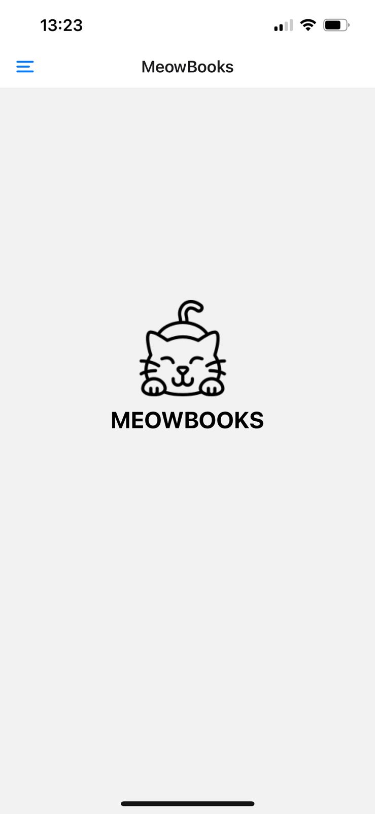

<body>
    <h1>Meow Cafe</h1>
    
Bem-vindo ao projeto <strong>Meow Cafe</strong>! MeowBooks é um aplicativo para busca de livros desenvolvido para a disciplina de mobile. Ele faz uso de uma API gratuita com livros cujo domínio é livre

</img>
</img>
    <h2>Informações do Projeto</h2>
    

        <strong>Nome:</strong> meowBook 
        <strong>Versão:</strong> 1.0.0 
        <strong>Entrada principal:</strong> expo/AppEntry.js
    

    <h2>Scripts</h2>
    
Os seguintes scripts estão disponíveis para uso:

    <pre><code>
    npm run start     // Inicia o servidor de desenvolvimento
    npm run android   // Inicia o aplicativo no Android
    npm run ios       // Inicia o aplicativo no iOS
    npm run web       // Inicia o aplicativo na web
    </code></pre>

    <h2>Dependências</h2>
    
As dependências do projeto incluem:

    <ul>
        <li><code>@react-navigation/drawer</code> - ^6.7.2</li>
        <li><code>axios</code> - ^1.7.7</li>
        <li><code>expo</code> - ~51.0.28</li>
        <li><code>expo-status-bar</code> - ~1.12.1</li>
        <li><code>react</code> - 18.2.0</li>
        <li><code>react-native</code> - 0.74.5</li>
        <li><code>react-native-gesture-handler</code> - ~2.16.1</li>
        <li><code>react-native-reanimated</code> - ~3.10.1</li>
    </ul>

    <h2>Dependências de Desenvolvimento</h2>
    
As dependências de desenvolvimento incluem:

    <ul>
        <li><code>@babel/core</code> - ^7.20.0</li>
        <li><code>@types/react</code> - ~18.2.45</li>
        <li><code>typescript</code> - ^5.1.3</li>
    </ul>

    <h2>Privado</h2>
    
Este projeto é privado.

    <h2>Contribuição</h2>
    
Sinta-se à vontade para contribuir para este projeto. Qualquer contribuição é bem-vinda!

    <h2>Licença</h2>
    
Este projeto não possui uma licença específica. Consulte a documentação para mais detalhes.

</body>

